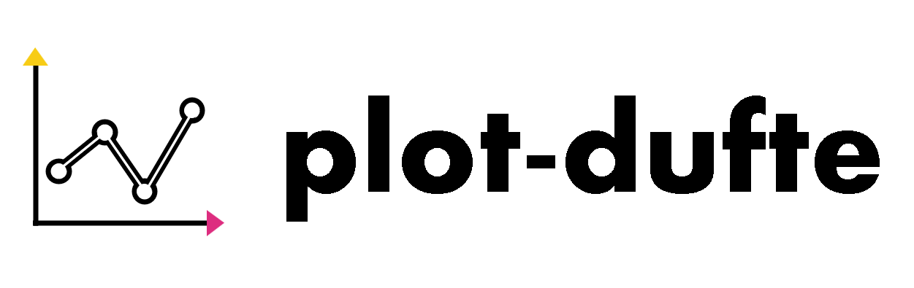

<p align="center">
  <br>
  <em>"Above all else show the data." – Edward Tufte (1983)</em>
</p>

---

Willkommen zur Dokumentation von plot-dufte!

plot-dufte ist eine Python-Bibliothek für moderne, minimalistische und anpassbare Plot-Designs nach den Tufte Designprinzipien ([The Beauty Of Data Visualization](https://www.edwardtufte.com/tufte/)).

## Plots
- [Dot-Dash Plot](plots/dot_dash.md)
- [Slopegraph](plots/slopegraph.md)
- [Range Frame](plots/range_frame.md)
- [Layered Focus](plots/layered_focus.md)
- [Small Multiples](plots/small_multiples.md)
- [Sparklines](plots/sparklines.md)
- [Time Series](plots/time_series.md)

## Installation

```bash
pip install plot-dufte
```

## Repository
Der Code zur Bibliothek ist unter [dufte-repository](https://github.com/Saplinging/dufte) dokumentiert.