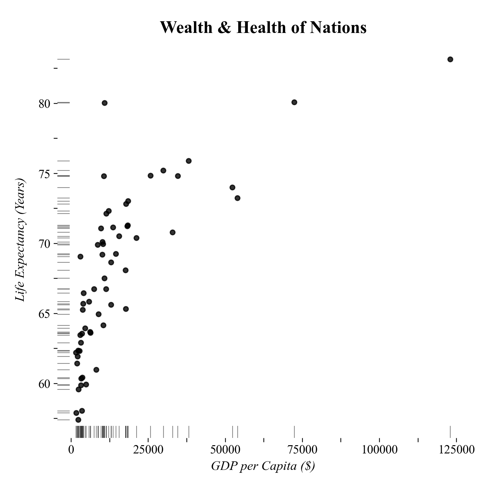

# Dot-Dash Plot

Ein Dot-Dash Plot ist ein minimalistischer Scatterplot mit Randverteilungen statt Achsenlinien.

--- 



---


## Funktion

```python
def dot_dash_plot(
    df: pd.DataFrame,
    x_col: str,
    y_col: str,
    title: str = "Dot-Dash Plot",
    **kwargs,
) -> ggplot:
```

**Parameter:**

- **df** (`pandas.DataFrame`): DataFrame mit den Daten für den Plot.
- **x_col** (`str`): Name der Spalte für die X-Achse (numerisch).
- **y_col** (`str`): Name der Spalte für die Y-Achse (numerisch).
- **title** (`str`, optional): Titel des Plots.
- **kwargs**: Zusätzliche Argumente für geom_point (z.B. color, alpha).

**Rückgabewert:**

- **plot** (`plotnine.ggplot`): Ein ggplot-Objekt mit dem Dot-Dash-Plot.

---


## Anwendungsbeispiel

Der folgende Beispielcode erzeugt den abgebildeten Beispieloutput.

```python
import pandas as pd
import numpy as np
import dufteplots as dp

# Beispieldaten
np.random.seed(42)
n_countries = 60
gdp = np.exp(np.random.normal(9, 1, n_countries))
life_exp = 45 + 5 * np.log(gdp / 100) + np.random.normal(0, 3, n_countries)
life_exp = np.clip(life_exp, 50, 85)
df = pd.DataFrame({
    "GDP per Capita ($)": gdp,
    "Life Expectancy (Years)": life_exp
})

# Dot-Dash-Plot erstellen
plot = dp.dot_dash_plot(
    df,
    x_col="GDP per Capita ($)",
    y_col="Life Expectancy (Years)",
    title="Wealth & Health of Nations (Dot-Dash)"
)

# Plot anzeigen
plot.show()
```