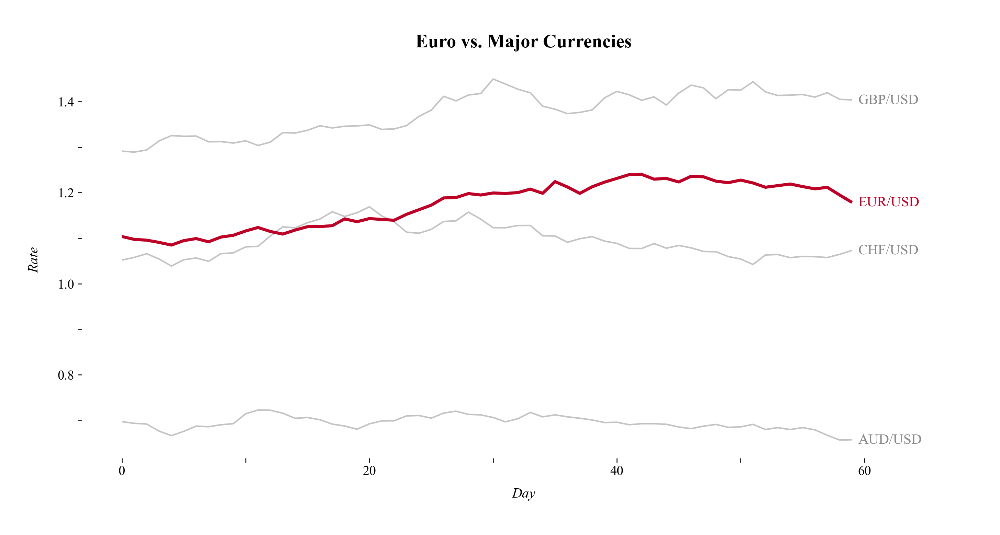

# Layered Focus Plot

Ein Layered-Focus-Plot hebt eine bestimmte Kategorie oder Datenreihe hervor, während andere als Kontext im Hintergrund angezeigt werden.

---




---


## Funktion

```python
def layered_focus(
    df: pd.DataFrame,
    time_col: str,
    value_col: str,
    category_col: str,
    focus_category: str,
    title: str = "Layering & Separation (Context vs. Focus)",
    **kwargs,
) -> ggplot:
```

**Parameter:**

- **df** (`pandas.DataFrame`): DataFrame mit den Daten für den Plot. Muss die Spalten für Zeit, Wert und Kategorie enthalten.
- **time_col** (`str`): Name der Spalte für die Zeitpunkte (x-Achse).
- **value_col** (`str`): Name der Spalte für die Werte (y-Achse).
- **category_col** (`str`): Name der Spalte für die Kategorien (Gruppierung).
- **focus_category** (`str`): Name der Kategorie, welche hervorgehoben werden soll.
- **title** (`str`, optional): Titel des Plots.
- **kwargs**: Zusätzliche Argumente für geom_line (z.B. color, alpha).

**Rückgabewert:**

- **plot** (`plotnine.ggplot`): Ein ggplot-Objekt mit dem Layering-Plot.

---


## Anwendungsbeispiel

Der folgende Beispielcode erzeugt den abgebildeten Beispieloutput.

```python
import pandas as pd
import numpy as np
from plot_dufte import layered_focus

# Beispieldaten
np.random.seed(42)
def generate_random_walk(start_price, n, volatility=0.01):
    returns = np.random.normal(loc=0.0005, scale=volatility, size=n)
    price_path = start_price * (1 + returns).cumprod()
    return price_path

n_days = 60
currencies = ["EUR/USD", "GBP/USD", "JPY/USD", "CHF/USD", "AUD/USD"]
start_vals = [1.10, 1.30, 0.009, 1.05, 0.70]

spark_data = []
for curr, start in zip(currencies, start_vals):
    values = generate_random_walk(start, n_days, volatility=0.01)
    for t, v in enumerate(values):
        spark_data.append({"Currency": curr, "Day": t, "Rate": v})

df = pd.DataFrame(spark_data)

# Plot erstellen (EUR/USD hervorheben)
plot = layered_focus(
    df,
    time_col="Day",
    value_col="Rate",
    category_col="Currency",
    focus_category="EUR/USD",
    title="Euro vs. Major Currencies (Contextual Layering)"
)

# Plot anzeigen
plot.show()
```