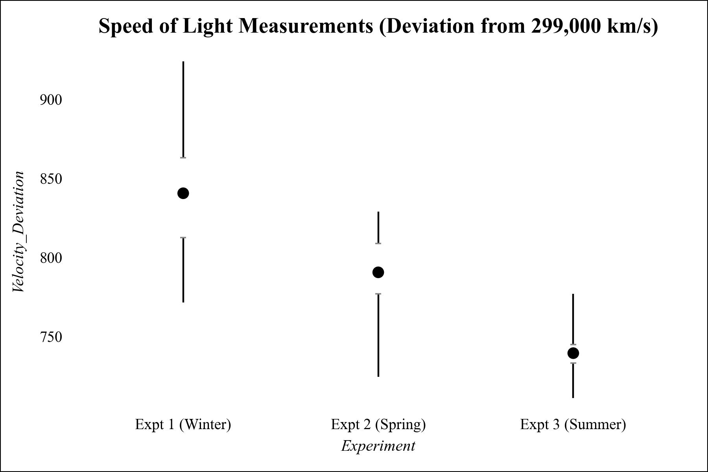

# Range Frame Plot


Ein Range-Frame Plot ist eine minimalistische Form von einem Boxplot.

{: style="height:450px; display:block; margin:0 auto"}

---


## Funktion

```python
def range_frame(
    df: pd.DataFrame,
    x_col: str,
    y_col: str,
    title: str = "Range-Frame Plot",
    **kwargs,
) -> ggplot:
```

**Parameter:**

- **df** (`pandas.DataFrame`): DataFrame mit den Daten für den Plot.
- **x_col** (`str`): Name der Spalte für die X-Achse (kategorisch oder kontinuierlich).
- **y_col** (`str`): Name der Spalte für die Y-Achse (numerisch).
- **title** (`str`, optional): Titel des Plots.
- **kwargs**: Zusätzliche Argumente für geom_point (z.B. color, alpha).

**Rückgabewert:**

- **plot** (`plotnine.ggplot`): Ein ggplot-Objekt mit dem Range-Frame-Plot.

---


## Anwendungsbeispiel

Der folgende Beispielcode erzeugt den abgebildeten Beispieloutput.

```python
import pandas as pd
import numpy as np
import dufteplots as dp

# Beispieldaten
np.random.seed(42)
n_meas = 40
df = pd.DataFrame({
    "Experiment": np.repeat(["Expt 1 (Winter)", "Expt 2 (Spring)", "Expt 3 (Summer)"], n_meas),
    "Velocity_Deviation": np.concatenate([
        np.random.normal(850, 40, n_meas),
        np.random.normal(790, 25, n_meas),
        np.random.normal(740, 15, n_meas)
    ])
})
df["Experiment"] = pd.Categorical(
    df["Experiment"],
    categories=["Expt 1 (Winter)", "Expt 2 (Spring)", "Expt 3 (Summer)"],
    ordered=True
)

# Range-Frame-Plot erstellen
plot = dp.range_frame(
    df,
    x_col="Experiment",
    y_col="Velocity_Deviation",
    title="Speed of Light Measurements (Deviation from 299,000 km/s)"
)

# Plot anzeigen
plot.show()
```
