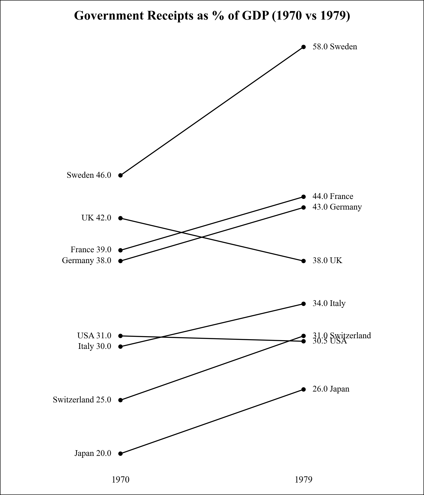

# Slopegraph

Ein Slopegraph zeigt Veränderungen einzelner Kategorien zwischen zwei Zeitpunkten und eignet sich besonders für Vorher-Nachher-Vergleiche.

---



---


## Funktion

```python
def slopegraph(
    df: pd.DataFrame,
    category_col: str,
    year_col: str,
    value_col: str,
    title: str = "Slopegraph",
    **kwargs
) -> ggplot:
```

**Parameter:**

- **df** (`pandas.DataFrame`): DataFrame mit den Daten für den Plot.
- **category_col** (`str`): Name der Spalte für die Kategorien (z.B. Länder).
- **year_col** (`str`): Name der Spalte für die Zeitpunkte (z.B. Jahre).
- **value_col** (`str`): Name der Spalte für die Werte (numerisch).
- **title** (`str`, optional): Titel des Plots.
- **kwargs**: Zusätzliche Argumente für geom_line (z.B. color, alpha).

**Rückgabewert:**

- **plot** (`plotnine.ggplot`): Ein ggplot-Objekt mit dem Slopegraph.

---


## Anwendungsbeispiel

Der folgende Beispielcode erzeugt den abgebildeten Beispieloutput.

```python
import pandas as pd
from plot_dufte import slopegraph

# Beispieldaten
countries = [
    "Switzerland", "USA", "Germany", "UK", "France", "Sweden", "Japan", "Italy"
]
y1970 = [25.0, 31.0, 38.0, 42.0, 39.0, 46.0, 20.0, 30.0]
y1979 = [31.0, 30.5, 43.0, 38.0, 44.0, 58.0, 26.0, 34.0]

data_slope = []
for country, v70, v79 in zip(countries, y1970, y1979):
    trend = "Increase" if v79 > v70 else "Decrease"
    data_slope.append({"Country": country, "Year": "1970", "Value": v70, "Trend": trend})
    data_slope.append({"Country": country, "Year": "1979", "Value": v79, "Trend": trend})

df = pd.DataFrame(data_slope)

# Slopegraph erstellen
plot = slopegraph(
    df,
    category_col="Country",
    year_col="Year",
    value_col="Value",
    title="Government Receipts as % of GDP (1970 vs 1979)"
)

# Anzeigen
print(plot)
```