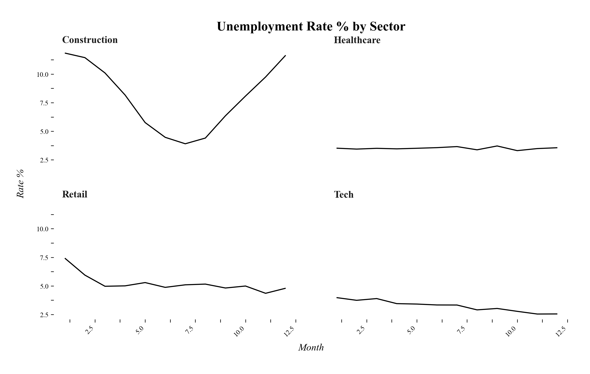

# Small Multiples

Small Multiples zeigen mehrere ähnliche Plots nebeneinander, um Vergleiche zwischen Gruppen oder Zeitpunkten zu ermöglichen, dabei teilen sich immer zwei Plots die X und Y-Achse.

---



---

## Funktion


```python
def small_multiples(
	df: pd.DataFrame,
	x_col: str,
	y_col: str,
	facet_col: str,
	title: str = "Small Multiples",
	ncol: int = 4,
	x_label: str | None = None,
	y_label: str | None = None,
	**kwargs
) -> ggplot:
```


**Parameter:**

- **df** (`pandas.DataFrame`): Daten für die einzelnen Plots
- **x_col** (`str`): Spaltenname für die X-Achse (kategorisch oder kontinuierlich)
- **y_col** (`str`): Spaltenname für die Y-Achse (numerisch)
- **facet_col** (`str`): Spaltenname für die Facettenkategorie
- **title** (`str`, optional): Plot-Titel
- **ncol** (`int`, optional): Anzahl der Spalten für die Facettenanordnung (Standard: 4)
- **x_label** (`str`, optional): Beschriftung der X-Achse
- **y_label** (`str`, optional): Beschriftung der Y-Achse
- **kwargs** (`optional`): Zusätzliche Argumente für geom_line (z.B. color, alpha)


**Rückgabewert:**

- **plot** (`plotnine.ggplot`): Das ggplot-Objekt

---

## Anwendungsbeispiel

Der folgende Beispielcode erzeugt den abgebildeten Beispieloutput.

```python
import pandas as pd
import numpy as np
import dufteplots as dp

# Beispieldaten wie im Hauptbeispiel (monatliche Arbeitslosenquote in Sektoren)
np.random.seed(42)
months = np.arange(1, 13)
dfs = []
# Construction: Hohe Saisonalität
dfs.append(pd.DataFrame({
	"Month": months,
	"Rate": 8 + 4 * np.cos((months - 1) / 12 * 2 * np.pi) + np.random.normal(0, 0.2, 12),
	"Sector": "Construction"
}))
# Retail: Peak im Januar
dfs.append(pd.DataFrame({
	"Month": months,
	"Rate": 5 + 2 * np.exp(-(months - 1)) + np.random.normal(0, 0.2, 12),
	"Sector": "Retail"
}))
# Tech: fallende Arbeitslosigkeit
dfs.append(pd.DataFrame({
	"Month": months,
	"Rate": np.linspace(4, 2.5, 12) + np.random.normal(0, 0.1, 12),
	"Sector": "Tech"
}))
# Healthcare: stabil
dfs.append(pd.DataFrame({
	"Month": months,
	"Rate": np.full(12, 3.5) + np.random.normal(0, 0.1, 12),
	"Sector": "Healthcare"
}))
df = pd.concat(dfs)

# Small Multiples erstellen
plot = dp.small_multiples(
	df,
	x_col="Month",
	y_col="Rate",
	facet_col="Sector",
	ncol=2,
	title="Unemployment Rate % by Sector (Seasonal Patterns)",
	x_label="Month",
	y_label="Rate %"
)

# Plot anzeigen
plot.show()
```