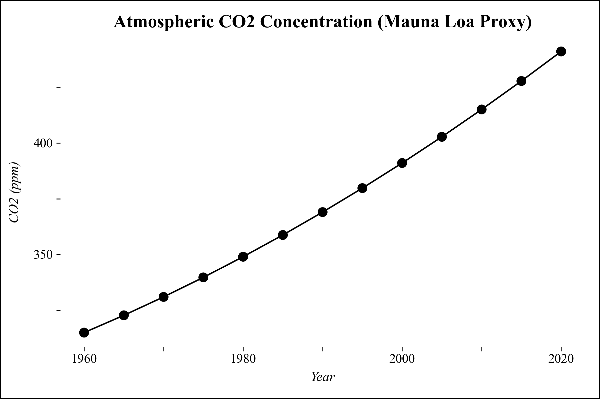

# Time Series Plot

Time Series Plots visualisieren Datenpunkte über die Zeit und eignen sich für Trendanalysen, Zeitverläufe und saisonale Muster.

---



---

## Funktion


```python
def time_series(
	df: pd.DataFrame,
	x_col: str,
	y_col: str,
	title: str = "Time Series",
	**kwargs
) -> ggplot:
```


**Parameter:**

- **df** (`pandas.DataFrame`): DataFrame mit den Daten für den Plot
- **x_col** (`str`): Spaltenname für die X-Achse (z.B. Jahre)
- **y_col** (`str`): Spaltenname für die Y-Achse (numerisch)
- **title** (`str`, optional): Plot-Titel
- **kwargs** (`optional`): Zusätzliche Argumente für geom_point (z.B. color, alpha)


**Rückgabewert:**

- **plot** (`plotnine.ggplot`): Das ggplot-Objekt

---

## Anwendungsbeispiel

Der folgende Beispielcode erzeugt den abgebildeten Beispieloutput.

```python
import pandas as pd
import numpy as np
from plot_dufte import time_series

# Beispieldaten
years = np.arange(1960, 2025, 5)
co2 = 315 + 1.5 * (years - 1960) + 0.01 * (years - 1960) ** 2
df = pd.DataFrame({"Year": years, "CO2 (ppm)": co2})

# Time Series Plot erstellen
plot = time_series(
    df,
    x_col="Year",
    y_col="CO2 (ppm)",
    title="Atmospheric CO2 Concentration (Mauna Loa Proxy)"
)

# Plot anzeigen
plot.show()
```